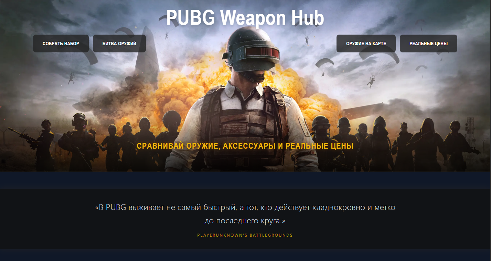
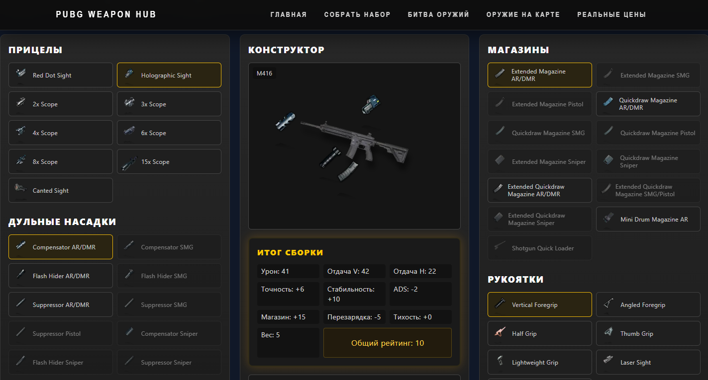
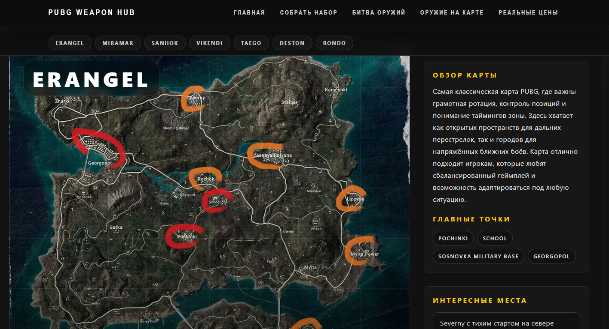

# PUBG Weapons Hub


**PUBG Weapons Hub** — веб-приложение, которое помогает игрокам PUBG находить оружие на карте, анализировать характеристики оружия, сравнивать различные конфигурации и подбирать оптимальные модификации для разных игровых сценариев. Проект разработан с использованием **Next.js**, **React** и **TypeScript** и демонстрирует современные подходы к разработке frontend-приложений.
## Preview



*Главная страница*



*Конструктор оружия*



*Карта оружий*

## Demo

**Frontend:** https://pubg-weaponshub.vercel.app

## Основные возможности

- каталог оружия PUBG;
- расположение оружия на игровых картах;
- просмотр подробных характеристик каждого вида оружия;
- подбор совместимых модификаций;
- создание пользовательских сборок;
- сравнение различных конфигураций;
- визуализация характеристик для быстрого анализа;
- помощь в выборе оптимального оружия под разные игровые сценарии;
- адаптивный интерфейс.

## Технологии

| Слой | Стек |
|------|------|
| Frontend | Next.js, React, TypeScript, Tailwind CSS |
| Charts | Recharts |
| Routing | Next.js App Router |
| Data | JSON |

## Архитектура

```text
src/
├── app/
├── components/
├── data/
├── types/
└── utils/
```

## Запуск проекта

```bash
npm install
npm run dev
```

После запуска приложение будет доступно по адресу:

```text
http://localhost:3000
```

## Архитектурные решения

- Next.js App Router;
- разделение на Server и Client Components;
- строгая типизация TypeScript;
- динамическая маршрутизация;
- переиспользуемые React-компоненты;
- хранение данных в JSON;
- визуализация характеристик с помощью Recharts.

## Планы развития

- Backend API;
- авторизация пользователей;
- сохранение пользовательских сборок;
- сравнение нескольких видов оружия;
- добавление новых игровых предметов и категорий;
- система комментариев для каждого вида оружия;
- форум для обсуждения оружия, сборок и игровых тактик.

---

**PUBG Weapons Hub** — проект, созданный для того, чтобы помочь игрокам PUBG быстрее находить оружие на игровых картах, анализировать его характеристики и выбирать наиболее эффективные модификации для различных игровых ситуаций. Приложение объединяет справочник вооружения, интерактивную карту и инструменты сравнения, а также демонстрирует использование современных возможностей **Next.js**, **TypeScript**, **Tailwind CSS**, **Recharts** и компонентного подхода к разработке React-приложений.